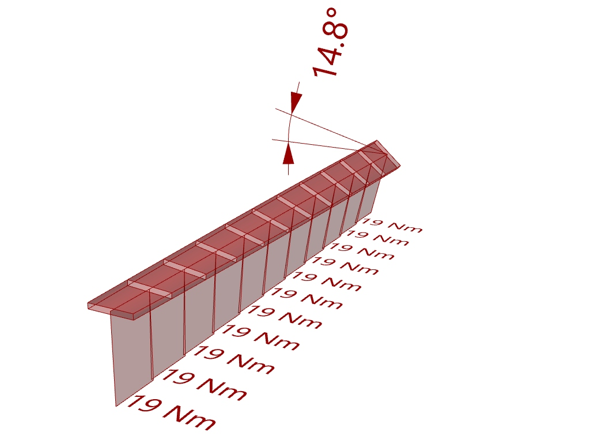

# Plywood strip torsion examlple

## Description
This example shows how to analyze a clamped beam subjected to a torsion point load at its free end. 

## Instructions
1. Download the [definition](Emu_PlywoodStripTorsion.gh)
2. Open the definition in Rhino 5 or Rhino 6
3. Star the simulation by double clicking on the timer component.

## Preview

