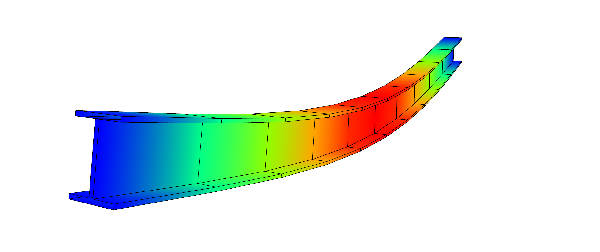
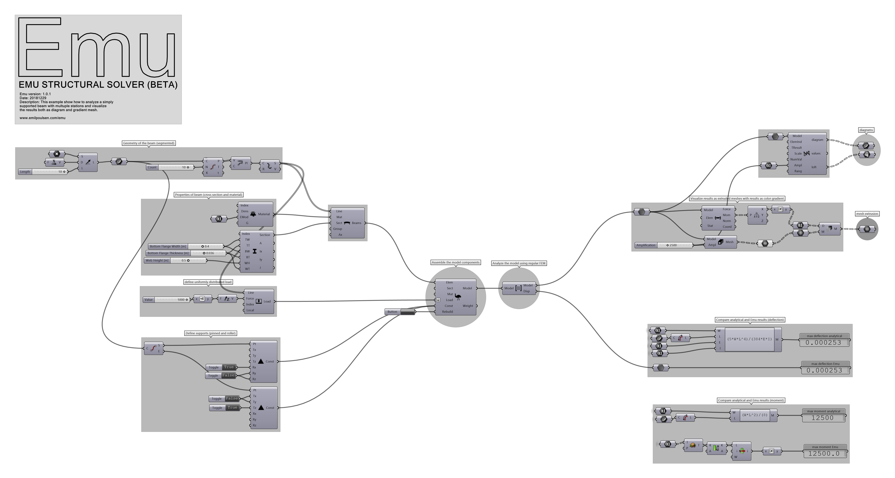

# Simply Supported Beam

## Description
This example shows how to analyze a simply supported beam with I shaped cross section subjected to uniformly distributed load. The analysis solver used is the Linear Static, I.e. not DR, although you would get (almost) identical results using DR. Some comparisons with analytical solutions for beam deflection and moments is also included in the definition to benchmark the accuracy of Emu.

## Instructions
1. Download the [definition](Emu_SimplySupportedBeam.gh)
2. Open the definition in Rhino 5 (you may encounter some meshing issues n R6 - I'm looking into this).
3. The solution should run and solve the structure as you open the definition.

## Preview

