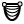

# Reaction Forces 
**Name:** Reaction Forces  
**NickName:** ReactForce  
**Description:** View the reaction forces in of model  

### Input
| Name | NickName | Description |
| ------ | ------ | ------ |
| Finite element Model | Model | The FE model to extract the reaction forces from. |
### Output
| Name | NickName | Description |
| ------ | ------ | ------ |
| Location | Loc | Location of the supports. |
| Forces | Forc | Forces |
| Moments | Mom | Moments |
| Vertical | Vert | Sum of vertical reaction forces [N]. |
# Section Viewer 
**Name:** Section Viewer  
**NickName:** SectionView  
**Description:** Visualize the extruded sections of the members in the model represented as meshes. The sections will correspond to what's been defined for each element.  

### Input
| Name | NickName | Description |
| ------ | ------ | ------ |
| Finite element Model | Model | The finite element model to operate on |
| Amplification | Ampl | Displacement amplification factor. 1 means the actual displacement. |
### Output
| Name | NickName | Description |
| ------ | ------ | ------ |
| Mesh extrusions | Mesh | The extruded cross sections along the members as meshes. |
# Element Index Selector 
**Name:** Element Index Selector  
**NickName:** ElementIndexSelector  
**Description:** Retrieve element indices  by filtering based on material, section and group.  

### Input
| Name | NickName | Description |
| ------ | ------ | ------ |
| Finite element Model | Model | The finite element model to operate on |
| Material | Mat | Material indices which will be sought for |
| Cross section | Sect | Cross section indices which will be sought for |
| Group | Group | Group indices which will be sought for |
### Output
| Name | NickName | Description |
| ------ | ------ | ------ |
| Indices | Indices | Generated indices |
# Diagram Viewer 
**Name:** Diagram Viewer  
**NickName:** DiagramViewer  
**Description:** Show force diagrams on elements.  

### Input
| Name | NickName | Description |
| ------ | ------ | ------ |
| Finite element Model | Model | The finite element model to operate on |
| Element indices | ElemInd | Element indices. All by default |
| Result Type | TResult | Type of result that should be displayed. MXX = 0, MYY = 1, Torsion = 2, Mtot = 3. Right click on input too choose option. |
| Scale | Scale | Scale the normalized values |
| NumDataPoints | NumVal | Number of values |
| Amplification | Ampl | Displacement amplification factor. 1 means the actual displacement. |
| Range | Rang | Range of values |
### Output
| Name | NickName | Description |
| ------ | ------ | ------ |
| diagram | diagram | diagram |
| values | values | values |
| loft | loft | loft |
# Element Force Viewer 
**Name:** Element Force Viewer  
**NickName:** ElemForceView  
**Description:** Ouput the internal forces and moments of elements  

### Input
| Name | NickName | Description |
| ------ | ------ | ------ |
| Finite element Model | Model | The finite element model to operate on |
| Element index | Elem | Element index |
| Stations | Stat | Number of stations per element. |
### Output
| Name | NickName | Description |
| ------ | ------ | ------ |
| Force | Force | Forces [N] |
| Moments | Mom | Moments [Nm] |
| Normal | Norm | Normal force magnitude |
| Coordinate systems | Coord | The local coordinate systems for the element. |
# Node Forces 
**Name:** Node Forces  
**NickName:** NodeForce  
**Description:** Extract the internal forces and moments of the nodes. During a relaxation process, this means the out of balace force. When the system has reached it's equilibrium configuration, all internal node forces should have reaced 0.  

### Input
| Name | NickName | Description |
| ------ | ------ | ------ |
| Finite element Model | Model | The finite element model to operate on |
### Output
| Name | NickName | Description |
| ------ | ------ | ------ |
| Forces | Forces | Forces |
| Moments | Moments | Moments |
# Centerline Viewer 
**Name:** Centerline Viewer  
**NickName:** CLineView  
**Description:** View the centerline geometry. Plug your relax output into this component to see the geometry for each iteration.  

### Input
| Name | NickName | Description |
| ------ | ------ | ------ |
| Finite element Model | Model | The finite element model to operate on |
| Amplification | Ampl | Displacement amplification factor. 1 means the actual displacement. |
### Output
| Name | NickName | Description |
| ------ | ------ | ------ |
| Nodes | Nodes | Displaced nodes |
| Lines | Lines | Displaced lines |
# Cable 
**Name:** Cable  
**NickName:** Cable  
**Description:** Create a 6 DOF cable element. Cables are capable of transferring tension, but not compression.   

### Input
| Name | NickName | Description |
| ------ | ------ | ------ |
| Lines | Line | Line to create cables of. |
| Material | Mat | Material or index. |
| Cross section | Sec | Cross section or index. |
| Group | Gro | Group |
### Output
| Name | NickName | Description |
| ------ | ------ | ------ |
| Cable | Cable | Generated Cables. |
# Lath 
**Name:** Lath  
**NickName:** Lath  
**Description:** Defines a continous grid-shell lath element. By using the group property, the lath can be programmed to transfer moments only to a selected subset of elements. Lath elements willonly transfer moments to other lath elements within the same group property.  

### Input
| Name | NickName | Description |
| ------ | ------ | ------ |
| Lines | Line | Lines to create Lath elements of. |
| Material | Mat | Material or index. |
| Cross section | Sec | Cross section or index. |
| Group | Gro | Group. |
### Output
| Name | NickName | Description |
| ------ | ------ | ------ |
| Laths | Lath | Generated Laths. |
# Gravity Load 
**Name:** Gravity Load  
**NickName:** GravityLoad  
**Description:** Apply gravity load on a structure.  The dead load of an element is calculated using information such as material density,  the cross section applied and the geomety.  

### Input
| Name | NickName | Description |
| ------ | ------ | ------ |
| Force [N/m2] | Force | Amplification vector. Default is (0,0,-1), which represents the structure's deadload in the -Z directio. |
| Index | Index | Index of load |
### Output
| Name | NickName | Description |
| ------ | ------ | ------ |
| Gravity Load | Load | Generated gravity load |
# Area Load 
**Name:** Area Load  
**NickName:** AreaLoad  
**Description:** Define an area load by a force vector [N/m2] and a mesh. Note that the all vertices of the mesh have to coincide with nodes in the model.   

### Input
| Name | NickName | Description |
| ------ | ------ | ------ |
| Mesh | Mesh | The mesh where the area load is applied. |
| Force [N/m2] | Force | Vector of pointload [N/m2]All vertices of the mesh have to coincide with nodes in the model. |
| Index | Index | Index of load |
### Output
| Name | NickName | Description |
| ------ | ------ | ------ |
| Area Load | Load | Generated area load |
# Spring 
**Name:** Spring  
**NickName:** Spring  
**Description:** Create a 6 DOF spring element. The spring can be used for geometrical form-finding, when structural quantaties (such as forces and moments) are not important.   

### Input
| Name | NickName | Description |
| ------ | ------ | ------ |
| Line | Line | Lines to create Springs of. |
| Spring Stiffness | Stiff | Define the stiffness of spring. |
| Slack Length | Slack | The slack length of the spring. During relaxation, the springs will try to reach this length. Can be used for pretension. |
| Group | Gro | Group |
### Output
| Name | NickName | Description |
| ------ | ------ | ------ |
| Springs | Spring | Generated Springs. |
# Bar 
**Name:** Bar  
**NickName:** Bar  
**Description:** Create a 6 DOF bar/truss element. No bending will occur in the elment, only axial force. In other words, the end nodes are only capable of transferring force, no moments.  

### Input
| Name | NickName | Description |
| ------ | ------ | ------ |
| Lines | Lines | Lines to create Bars elements of. |
| Material | Mat | Material index. |
| Cross section | Sec | Cross section index. |
| Group | Gro | Group |
### Output
| Name | NickName | Description |
| ------ | ------ | ------ |
| Bars | Bars | Generated bars |
# Restraint 
**Name:** Restraint  
**NickName:** Restraint  
**Description:** Restrain a node's degrees of freedom  

### Input
| Name | NickName | Description |
| ------ | ------ | ------ |
| Point | Pt | Points to constain |
| Translational X | Tx | Lock translational of X |
| Translational Y | Ty | Lock translational of Y |
| Translational Z | Tz | Lock translational of Z |
| Rotational X | Rx | Lock rotation around X |
| Rotational Y | Ry | Lock rotation around Y |
| Rotational Z | Rz | Lock rotation around Z |
### Output
| Name | NickName | Description |
| ------ | ------ | ------ |
| Restraint | Restr | Generated restraint. |
# Model 
**Name:** Model  
**NickName:** Model  
**Description:** Defines a Structural model. Assemble all elements, loads, restraints, materials and cross sections using this component.  

### Input
| Name | NickName | Description |
| ------ | ------ | ------ |
| Elements | Elem | Elements in the model. |
| Cross sections | Sect | Cross sections in the model. |
| Materials | Mat | Materials in the model. |
| Loads | Load | Loads in the model. |
| Restraints | Restr | Restraints in the model. |
| Rebuild | Rebuild | Activating this will rebuild the whole FE model. Necessary if you add more elements. |
### Output
| Name | NickName | Description |
| ------ | ------ | ------ |
| Model | Model | Model of FE system |
| Weight [kg] | Weight | The total weight of the model [kg] |
# Beam 
**Name:** Beam  
**NickName:** Beam  
**Description:** Create a 12 DOF Beam element from a line, material and cross section. By default a steel material and a circular section is assigned to the beam.  

### Input
| Name | NickName | Description |
| ------ | ------ | ------ |
| Line | Lines | Lines to create beams of |
| Material | Mat | Material or index. |
| Cross section | Sec | Cross section or index. |
| Group | Gro | Group |
| Coordinate axis | Ax | Local Y coordinate axis. |
### Output
| Name | NickName | Description |
| ------ | ------ | ------ |
| Beams | Beam | Generated beams |
# Linear Load 
**Name:** Linear Load  
**NickName:** LinearLoad  
**Description:** Define a load per length unit [N/m]. Note that the line has to coincide with an existing linear element in the model.   

### Input
| Name | NickName | Description |
| ------ | ------ | ------ |
| Line | Line | Line to apply load on |
| Force | Force | Vector of pointload [N/m] |
| Index | Index | Index of load |
| Local | Local | If set to true, loads will be applied local relative to the element's coordinate system. Otherwise global. |
### Output
| Name | NickName | Description |
| ------ | ------ | ------ |
| PointLoad | Load | Generated point loads |
# Point Load 
**Name:** Point Load  
**NickName:** PointLoad  
**Description:** Define a point load with a force vector [N] and a anchor point.   

### Input
| Name | NickName | Description |
| ------ | ------ | ------ |
| Position | Pos | Positions of pointload |
| Force | Force | Vector of point load [N] |
| Moment | Moment | Vector of moment load [Nm] |
| Index | Index | Index of load |
### Output
| Name | NickName | Description |
| ------ | ------ | ------ |
| PointLoad | Load | Generated point loads |
# Material Database 
**Name:** Material Database  
**NickName:** Mat DB  
**Description:** Material Database.  

### Input
| Name | NickName | Description |
| ------ | ------ | ------ |
| Material index | I | Assign the selected material an index |
### Output
| Name | NickName | Description |
| ------ | ------ | ------ |
| Material | M | Generated material |
# Custom Material 
**Name:** Custom Material  
**NickName:** CustomMaterial  
**Description:** Create a custom isotropic homogenious material  

### Input
| Name | NickName | Description |
| ------ | ------ | ------ |
| Index | Index | Index of the material. Could be a text string or a number. |
| Density | Dens | Density of material [kg/m3] |
| Youngs modulus | EMod | Youngs modulus [Pa] |
| Shear Modulus | G | Shear modulus [Pa] |
### Output
| Name | NickName | Description |
| ------ | ------ | ------ |
| Material | Material | Generated material |
# PluginInfo 
**Name:** PluginInfo  
**NickName:** PluginInfo  
**Description:** Gets information about the plugin   

### Output
| Name | NickName | Description |
| ------ | ------ | ------ |
| info | info | info |
# Mesh Vextex Normals 
**Name:** Mesh Vextex Normals  
**NickName:** MeshVertexNormals  
**Description:** Computes the vertex normals of a mesh. This is done by averaging the surrounding face normals around a vertex.  

### Input
| Name | NickName | Description |
| ------ | ------ | ------ |
| Mesh | m | Mesh to operate on |
### Output
| Name | NickName | Description |
| ------ | ------ | ------ |
| Vectors | V | Vertex normals |
| Points | P | Vertices |
| Areas | A | Areas |
# IShape Section 
**Name:** IShape Section  
**NickName:** IShapeSection  
**Description:** Create an I Shape section by providing overall depth, overall width, top flange depth, web width, bottom flange width, and bottom flange depth  

### Input
| Name | NickName | Description |
| ------ | ------ | ------ |
| Index | Index | Index of the cross section |
| Top Flange Width [m] | TW | Top Flange Width [m] |
| Top Flange Thickness [m] | TT | Top Flange Thickness [m] |
| Bottom Flange Width [m] | BW | Bottom Flange Width [m] |
| Bottom Flange Thickness [m] | BT | Bottom Flange Thickness [m] |
| Web Height [m] | WH | Web Height [m] |
| Web Thickness [m] | WT | Web Thickness [m] |
### Output
| Name | NickName | Description |
| ------ | ------ | ------ |
| Section | Section | Generated section |
| Area | A | Area |
| Second moment of area around x | Ix | Second moment of area around x |
| Second moment of area around y | Iy | Second moment of area around y |
| Moment of inertia torsion | J | moment of inertia torsion |
# Matrix Stiffness Solver 
**Name:** Matrix Stiffness Solver  
**NickName:** MatrixStiffnessSolver  
**Description:** Solves the static equilibrium state of a Model. The underlying algorithm is based on solving the system of linear system of equations Ka=f.  

### Input
| Name | NickName | Description |
| ------ | ------ | ------ |
| Finite element Model | Model | The finite element model to solve. |
### Output
| Name | NickName | Description |
| ------ | ------ | ------ |
| Model | Model | Model with results. |
| Max displacement [m] | Disp | The maximum node displacment  currently present in the model. [m] |
# Hollow Box Section 
**Name:** Hollow Box Section  
**NickName:** HollowBox  
**Description:** Create a Hollow Box Section by providing height, width and thickness.  

### Input
| Name | NickName | Description |
| ------ | ------ | ------ |
| Index | Index | Index of the cross section |
| Height [m] | H | Height of cross section [m] |
| Width [m] | W | Width of cross section [m] |
| Thickness [m] | t | Thickness of [m] |
### Output
| Name | NickName | Description |
| ------ | ------ | ------ |
| Section | Section | Generated section |
| Area | A | Area |
| Second moment of area around x | Ix | Second moment of area around x |
| Second moment of area around y | Iy | Second moment of area around y |
| Moment of inertia torsion | J | moment of inertia torsion |
# Solid Box Section 
**Name:** Solid Box Section  
**NickName:** SolidBoxSection  
**Description:** Create a solid box section by providing a height and width.  

### Input
| Name | NickName | Description |
| ------ | ------ | ------ |
| Index | Index | Index of the cross section |
| Height [m] | H | Height of cross section [m] |
| Width [m] | W | Width of cross section [m] |
### Output
| Name | NickName | Description |
| ------ | ------ | ------ |
| Section | Section | Generated section |
| Area | A | Area |
| Second moment of area around x | Ix | Second moment of area around x |
| Second moment of area around y | Iy | Second moment of area around y |
| Moment of inertia torsion | J | moment of inertia torsion |
# Generic Section 
**Name:** Generic Section  
**NickName:** GenericSection  
**Description:** Create a generic cross section by providing numerical data.  

### Input
| Name | NickName | Description |
| ------ | ------ | ------ |
| Index | Index | Index of the cross section |
| Area | A | Area of cross section |
| Ixx | Ixx | Second moment of area around X |
| Iyy | Iyy | Second moment of area around Y |
| J | J | Moment of inertia in torsion |
### Output
| Name | NickName | Description |
| ------ | ------ | ------ |
| Section | Section | Generated section |
# Circular Section 
**Name:** Circular Section  
**NickName:** CircularSection  
**Description:** Create a Circular Hollow Section (CHS) based on a radius and a thickness.  

### Input
| Name | NickName | Description |
| ------ | ------ | ------ |
| Index | Index | Index of the cross section |
| Outer radius [m] | Rad | Outer radius of circular section [m] |
| Thickness [m] | Thick | Thickness of the circular section [m] |
### Output
| Name | NickName | Description |
| ------ | ------ | ------ |
| Section | Sec | Generated section |
| Area | A | Area [m2] |
| Second moment of area | I | Second moment of area |
# Dynamic Relaxation Properties 
**Name:** Dynamic Relaxation Properties  
**NickName:** DrProp  
**Description:** Properties to manually set the options for the Dynamic Relaxation solver.  

### Input
| Name | NickName | Description |
| ------ | ------ | ------ |
| Mass | Mass | Override the fictional mass of the nodes. |
| Delta time | Time | The time step. Be careful: a too large time step may explode the model. |
| Damping | Damp | The damping of a |
| Integration Method | Meth | Integration Method |
| Iterations Per Step | Iter | The solver will iterate this many times before updating the Grasshopper component. |
| Equilibrium Threshold | Eq | The force/moment tolerance of the solver. If the out-of-balance force/moment is under this limit, then the system will be considered to be in equilibrium. |
### Output
| Name | NickName | Description |
| ------ | ------ | ------ |
| Integration Properties | Prop | The integration properties defined for this model. |
# Dynamic Relaxation Solver 
**Name:** Dynamic Relaxation Solver  
**NickName:** DrSolver  
**Description:** Solver using the Dynamic Relaxation method to find the equilibrium state of a model through time stepping. Connect the timer to this component to animate the process.  

### Input
| Name | NickName | Description |
| ------ | ------ | ------ |
| Finite element Model | Model | The finite element model to operate on. |
| Integration properties | Prop | Integration properties to control the relaxation process. |
| Reset | Res | Reset the relaxation process. |
### Output
| Name | NickName | Description |
| ------ | ------ | ------ |
| Model | Model | Model with analysis results. |
| Out of balance Force [N] | ResF | The residual out-of-balance Force for the current iteration. This should be close to 0 when the system has converged. [N] |
| Out of balance Moment [Nm] | ResM | The residual out-of-balance Moment for the current iteration. This should be close to 0 when the system has converged. [Nm] |
| Max displacement [m] | Disp | The maximum node displacment  currently present in the model. [m] |
